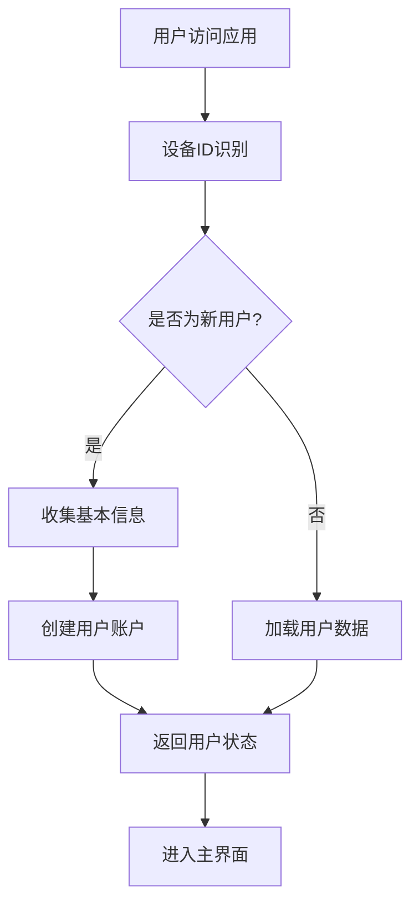
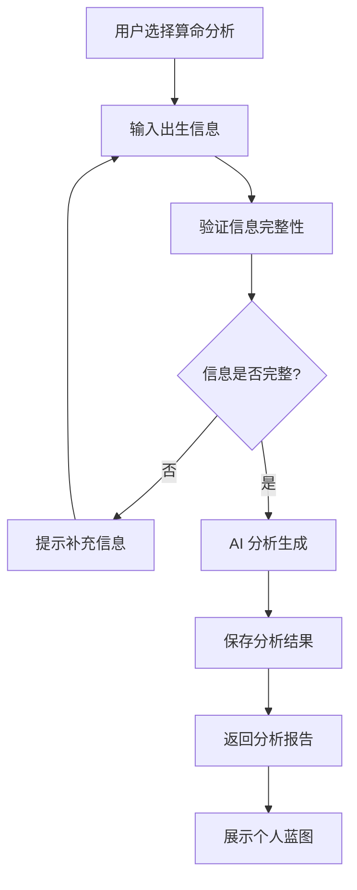
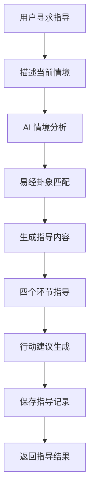
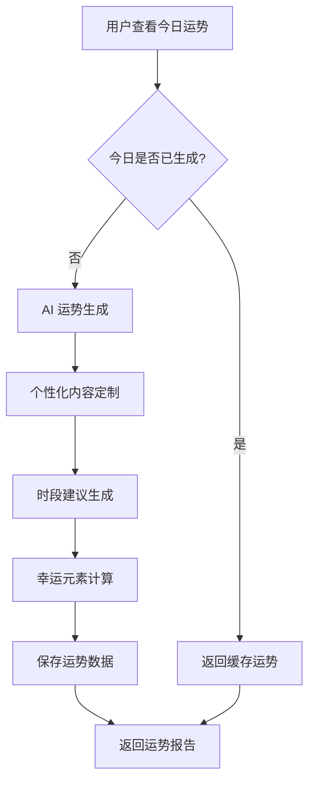

# 业务流程和系统架构

## 📋 概述

本目录包含 Realm of Balance App 的业务流程设计、系统架构分析和业务逻辑说明等核心文档。

## 📁 目录结构

```
business/
├── README.md                    # 本文件 - 业务流程说明
└── BUSINESS_FLOW.md            # 详细的业务流程文档
```

## 🏗️ 系统架构

### 整体业务架构

```
┌─────────────────────────────────────────────────────────────┐
│                    前端用户界面                              │
│              (React/Vue 移动端/Web端)                      │
└─────────────────────┬───────────────────────────────────────┘
                      │
                      ▼
┌─────────────────────────────────────────────────────────────┐
│                    API 网关层                               │
│                 (FastAPI 路由)                             │
└─────────────────────┬───────────────────────────────────────┘
                      │
                      ▼
┌─────────────────────────────────────────────────────────────┐
│                    业务逻辑层                               │
│              (用户服务、算命服务、运势服务)                 │
└─────────────────────┬───────────────────────────────────────┘
                      │
                      ▼
┌─────────────────────────────────────────────────────────────┐
│                    AI 智能层                                │
│                (Gemini API 集成)                           │
└─────────────────────┬───────────────────────────────────────┘
                      │
                      ▼
┌─────────────────────────────────────────────────────────────┐
│                    数据存储层                               │
│              (MongoDB + Redis 缓存)                        │
└─────────────────────────────────────────────────────────────┘
```

### 核心业务模块

1. **用户管理系统**
   - 用户注册和身份识别
   - 个人信息管理
   - 设备绑定和状态跟踪

2. **算命分析系统**
   - 八字排盘和五行分析
   - 个人特质分析
   - 生命曲线预测

3. **Heart Compass 指导系统**
   - 易经决策指导
   - 情境匹配分析
   - 行动建议生成

4. **每日运势系统**
   - 个性化运势生成
   - 时段建议和幸运元素
   - 运势历史管理

## 🔄 核心业务流程

### 1. 用户注册流程



**关键步骤**:
- 基于设备ID的用户识别
- 渐进式信息收集
- 用户状态管理

### 2. 算命分析流程



**关键特性**:
- 基于二十四节气的时间校准
- AI 驱动的个性化分析
- 结构化的结果展示

### 3. Heart Compass 指导流程



**指导环节**:
1. **情境理解**: 分析用户当前状况
2. **易经智慧**: 匹配相应的卦象和智慧
3. **决策指导**: 提供具体的决策建议
4. **行动协议**: 制定可执行的行动计划

### 4. 每日运势生成流程



**运势内容**:
- 整体运势评估
- 早中晚三个时段建议
- 幸运颜色、方向、数字等

## 📊 数据流设计

### 数据输入流

1. **用户信息输入**
   - 基本信息: 姓名、性别、出生日期时间
   - 设备信息: 设备ID、操作系统、应用版本
   - 使用行为: 功能使用频率、停留时间

2. **AI 分析输入**
   - 用户出生信息
   - 当前情境描述
   - 历史数据参考

### 数据处理流

1. **数据验证和清洗**
   - 输入格式验证
   - 数据完整性检查
   - 异常值处理

2. **AI 智能处理**
   - 提示词模板加载
   - 上下文信息组装
   - API 调用和响应处理

3. **结果优化和格式化**
   - 内容结构优化
   - 用户友好性改进
   - 多语言支持

### 数据输出流

1. **结构化数据**
   - JSON 格式的 API 响应
   - 数据库存储的记录
   - 缓存数据

2. **用户界面数据**
   - 前端组件所需的数据格式
   - 实时更新的状态信息
   - 错误和成功消息

## 🎯 业务规则

### 1. 用户管理规则

- **设备绑定**: 一个设备只能绑定一个用户账户
- **信息完整性**: 算命分析需要完整的出生信息
- **数据隐私**: 用户数据严格保密，不对外泄露

### 2. 算命分析规则

- **时间精度**: 出生时间精确到小时
- **节气校准**: 基于二十四节气进行时间校准
- **结果唯一性**: 相同用户相同时间生成相同结果

### 3. 运势生成规则

- **每日限制**: 每个用户每天只能生成一次运势
- **个性化**: 基于用户信息定制运势内容
- **时效性**: 运势内容有时效性，过期需要重新生成

### 4. 指导系统规则

- **情境匹配**: 基于用户描述的情境进行智能匹配
- **历史记录**: 保存所有指导记录供用户回顾
- **个性化建议**: 根据用户特点提供定制化建议

## 🔐 业务安全

### 1. 数据安全

- **加密存储**: 敏感信息加密存储
- **访问控制**: 基于用户权限的数据访问
- **审计日志**: 所有操作都有详细日志记录

### 2. 业务安全

- **频率限制**: API 调用频率限制防止滥用
- **输入验证**: 严格的输入验证防止恶意数据
- **错误处理**: 完善的错误处理不泄露系统信息

### 3. 隐私保护

- **数据最小化**: 只收集必要的用户信息
- **用户控制**: 用户对自己的数据有完全控制权
- **合规性**: 符合相关法律法规要求

## 📈 性能优化

### 1. 缓存策略

- **热点数据缓存**: 用户信息、配置信息等
- **计算结果缓存**: AI 分析结果、运势数据等
- **版本控制**: 避免缓存不一致问题

### 2. 异步处理

- **并发请求**: 支持大量并发用户
- **非阻塞操作**: 提高系统响应速度
- **资源池化**: 智能管理数据库和缓存连接

### 3. 智能优化

- **预测性缓存**: 基于用户行为预测需要的数据
- **负载均衡**: 智能分配系统资源
- **降级策略**: 在系统压力大时提供降级服务

## 🔄 业务流程监控

### 1. 关键指标

- **用户活跃度**: 日活跃用户、月活跃用户
- **功能使用率**: 各功能模块的使用频率
- **系统性能**: 响应时间、吞吐量、错误率

### 2. 监控方式

- **实时监控**: 系统运行状态的实时监控
- **日志分析**: 详细的日志记录和分析
- **用户反馈**: 用户使用体验的反馈收集

### 3. 告警机制

- **性能告警**: 系统性能下降时的告警
- **错误告警**: 系统错误发生时的告警
- **业务告警**: 业务异常发生时的告警

## 📚 相关文档

- [API 接口文档](../api/README.md)
- [后端实现指南](../backend/BACKEND_IMPLEMENTATION_GUIDE.md)
- [前端集成指南](../frontend/FRONTEND_API_INTEGRATION_GUIDE.md)
- [测试指南](../testing/TESTING_GUIDE.md)
- [环境配置指南](../setup/README.md)

## 💡 业务优化建议

### 1. 用户体验优化

- **流程简化**: 减少不必要的步骤
- **智能推荐**: 基于用户行为推荐功能
- **个性化定制**: 根据用户偏好定制界面

### 2. 业务逻辑优化

- **规则引擎**: 使用规则引擎管理复杂业务逻辑
- **工作流管理**: 标准化业务流程管理
- **异常处理**: 完善的异常处理机制

### 3. 数据质量优化

- **数据验证**: 多层次的数据验证机制
- **数据清洗**: 自动化的数据清洗流程
- **质量监控**: 持续的数据质量监控

## 🚨 风险控制

### 1. 技术风险

- **系统稳定性**: 完善的监控和告警机制
- **数据安全**: 多层次的数据安全保护
- **性能风险**: 性能测试和容量规划

### 2. 业务风险

- **合规风险**: 确保业务合规性
- **市场风险**: 市场变化对业务的影响
- **竞争风险**: 竞争对手的策略分析

### 3. 运营风险

- **用户流失**: 用户满意度监控
- **服务质量**: 服务质量的持续改进
- **成本控制**: 运营成本的合理控制

## 📞 支持

如有业务流程相关问题，请：
1. 查看详细业务流程文档
2. 联系业务分析师
3. 提交功能需求建议
4. 参与业务流程优化讨论
